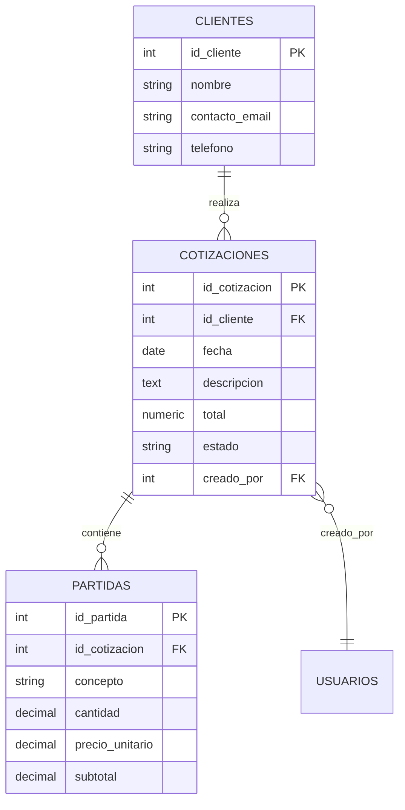

# cloud-computing-ms-cotizaciones

```mermaid


erDiagram
    CLIENTES {
        int id_cliente PK
        string nombre
        string contacto_email
        string telefono
    }

    COTIZACIONES {
        int id_cotizacion PK
        int id_cliente FK
        date fecha
        text descripcion
        numeric total
        string estado
        int creado_por FK
    }

    PARTIDAS {
        int id_partida PK
        int id_cotizacion FK
        string concepto
        decimal cantidad
        decimal precio_unitario
        decimal subtotal
    }

    CLIENTES ||--o{ COTIZACIONES : "realiza"
    COTIZACIONES ||--o{ PARTIDAS : "contiene"
    COTIZACIONES }o--|| USUARIOS : "creado_por"

```
